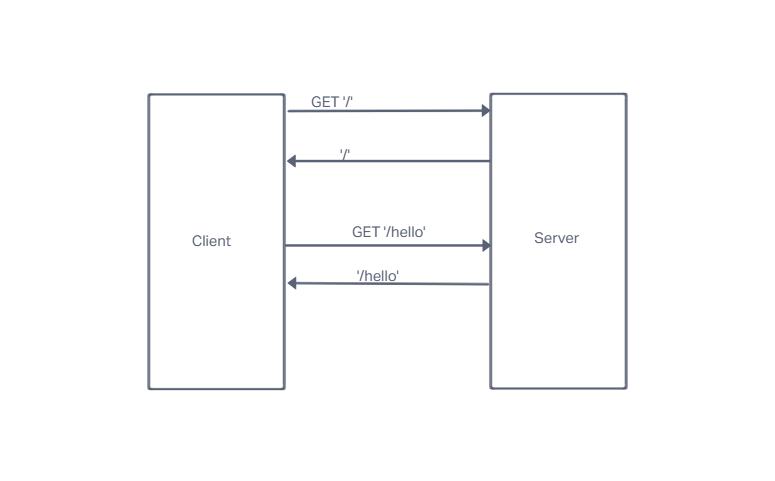

# LAB - Class 01

## Project: Server Deployment Practice

### Author: Brady Davenport

### Problem Domain

Practice Node.js development using CI/CD.

### Links and Resources

- [Prod url](https://bradyd-server-deploy-prod.herokuapp.com/)
- [Dev url](https://bradyd-server-deploy-dev.herokuapp.com/)
- [GitHub Repo](https://github.com/bradydavenport/server-deployment-practice)

### Setup

#### `.env` requirements

i.e.

- `PORT` - Port Number

#### How to initialize/run the application

`nodemon`

#### How to use the library

#### Features / Routes

- GET : `/hello` -

#### Tests

`npm test` in the terminal will test the `get` routes, ensuring they respond with the correct statuses and messages

#### UML

